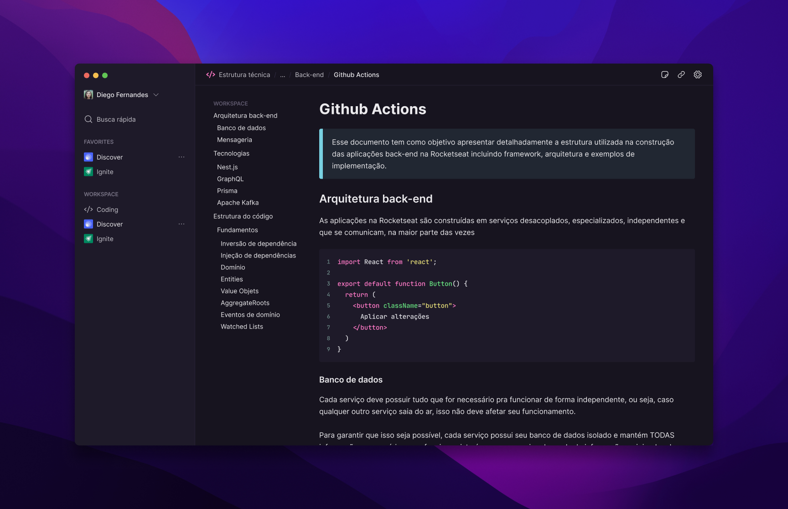

<h1 align="center">
  Rotion
  <hr />
  
</h1>

<p align="center">
  

  

  <a href="https://github.com/amanda-santos/rotion/commits/master">
    
  </a>

  <a href="https://github.com/amanda-santos/rotion/issues">
    
  </a>
</p>

<p align="center">
  <a href="#-about-the-project">About the project</a>&nbsp;&nbsp;&nbsp;|&nbsp;&nbsp;&nbsp;
  <a href="#-layout">Layout</a>&nbsp;&nbsp;&nbsp;|&nbsp;&nbsp;&nbsp;
  <a href="#-technologies">Technologies</a>&nbsp;&nbsp;&nbsp;|&nbsp;&nbsp;&nbsp;
  <a href="#-preview">Preview</a>&nbsp;&nbsp;&nbsp;|&nbsp;&nbsp;&nbsp;
  <a href="#-getting-started">Getting started</a>&nbsp;&nbsp;&nbsp;|&nbsp;&nbsp;&nbsp;
  <a href="#-how-to-contribute">How to contribute</a>&nbsp;&nbsp;&nbsp;
</p>

## 📝 About the project

<p>
Rotion is an alternative to Notion built for learning proposes with Electron. The application is available in English 🇬🇧.
</p>

<p>
Developed during the course Desktop Apps with Electron by <a href="https://rocketseat.com.br/">Rocketseat</a>. 🚀
</p>

## 🎨 Layout

<p>
  Click <a href="https://www.figma.com/file/F9swHCTv0wblvseZ9uGQh5/Rotion-(Curso-de-Electron)-(Copy)?node-id=1%3A46&t=pfUjq6DZgSRr6CFW-1">here</a> to check the layout on Figma.
</p>

## 👩🏻‍💻 Technologies

Technologies used to develop this project:

- Electron
- TypeScript
- React
- TailwindCSS
- React Query
- TipTap Editor
- Phosphor Icons

## 🖥 Preview


https://user-images.githubusercontent.com/49074930/207175026-c1ac22c1-2617-47a4-b1a3-664119c34e98.mp4


## ⌨ Getting started

- Run `npm i` or `yarn` to install the dependencies
- Open the application with `npx expo start`

## 🤔 How to contribute

**Make a fork of this repository**

```bash
# Fork using GitHub official command line
# If you don't have the GitHub CLI, use the web site to do that.

$ gh repo fork amanda-santos/rotion
```

**Follow the steps below**

```bash
# Clone your fork
$ git clone your-fork-url && cd rotion

# Create a branch with your feature
$ git checkout -b my-feature

# Make the commit with your changes
$ git commit -m 'feat: My new feature'

# Send the code to your remote branch
$ git push origin my-feature
```

After your pull request is merged, you can delete your branch

---

Made with 💜 by Amanda Santos
